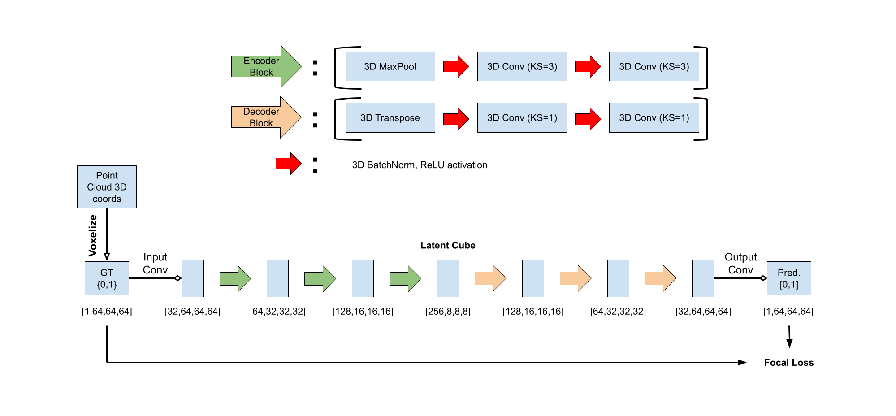
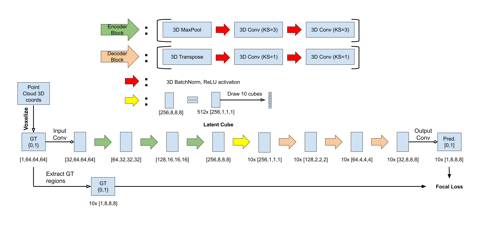

# VoxelMorph: Voxel-based Approaches for Neuronal Morphology Learning

## Overview
This project is part of my master's thesis, focusing on learning the morphology of neurons using a voxel-based approach. The goal is to effectively learn and represent the 3D neuron structures through machine learning models.

Two variations of autoencoder architectures are implemented: the **VoxelMorph Dense** model, which uses a dense 3D convolutional structure, and the **VoxelMorph nLat** model, which reduces memory consumption by selecting a subset of latent cubes for decoding.

The following diagrams illustrate the structure of both models at a grid resolution of 64:


*Figure 1: Architecture of the VoxelMorph Dense model.*


*Figure 2: Architecture of the VoxelMorph nLat model.*

These models are applied to voxel grids of two resolutions: grid sizes of 64 and 128, which determine the level of detail in neuron reconstruction.


## Data
The dataset used in this project is the MICrONS dataset, which contains neural tissue samples from the primary visual cortex (V1) and two higher visual areas, anterolateral (AL) and rostrolateral (RL), of an adult P75-87 mouse. Each neuron is represented by a point cloud spanning a volume of 1.3 mm × 0.87 mm × 0.82 mm. The point cloud data is normalized to the range [-1,1], centered at the neuron’s soma, and then converted into a voxel grid for analysis. In total, the dataset used contains approximately 48,500 neurons, with about 41,000 neurons used for training.


## Setup
1. Navigate to the project directory
```
cd VoxelMorph
```

2. Create the conda environment:

In `setup.sh`, replace `<PATH>` with the location where you want the Conda environment to be created.
```
chmod 755 setup.sh
source setup.sh
```

3. Activate the new environment:
```
conda activate <PATH>/voxel_env
```
4. Verify that the new environment was installed correctly:
```
conda env list
```


## Reproducing experiments
The `training_scripts` directory contains the training files for all four model variations.

For monitoring progress, you can either check the outfiles or connect your WandB.ai account and adjust the logging settings accordingly.

To start training, execute the script `bash_scripts/hpc_script.sh`, replacing the path for the error and output files as well as your user credentials beforehand.

Update the `save_checkpoint` function in the respective training scripts to specify the correct path for saving the model.


## Inference and Visualization

The `notebooks` directory contains four notebooks, one for each of the model variations (VoxelMorph Dense and nLat at grid sizes 64 and 128). Each notebook allows you to run inference on test, validation, and train data, and visualize reconstructed neurons.
To visualize the latent embeddings of the training neurons, use the additional notebook `latent_embeddings_tsne.ipynb`, which generates t-SNE plots of the latent space. In the `embeddings` directory, two scripts—one for each resolution—are available, which were used to create the latent embeddings.


## Contact
If you have any questions, please feel free to email the authors.

lucas.mohrhagen@gmail.com
